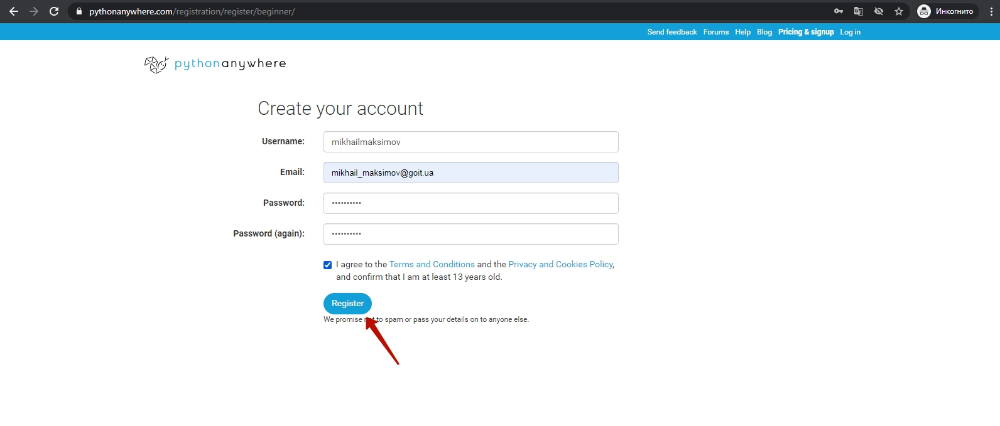

# Автокурс Python
Здравствуйте!  
Мы начинаем изучение языка программирования Python.  
Что делает Python?  
Python - это язык программирования, который позволяет создавать программы для компьютера (можно написать программу для структурирования файлов на компьютере или программу, которая производит вычисления беря данные из файлов), программы для сервера (это могут быть телеграмм-боты или сайты) и даже программирующие искусственный интеллект (это системы машинного обучения и искусственных нейронных сетей).  
Ух-ты, класс! А как это все сделать?  
Первым шагом для любого программиста является создание собственного рабочего места, т.е. настройка программ, которые позволят писать программы.  
Самым удобным способом для программиста является установка и настройка программ на его рабочем компьютере. Но очень часто, т.к. все компьютеры разные, возникают особенности установки, с которой новички могут быстро не справиться, а это, в свою очередь, может привести к разочарованию и потере интереса к сфере программирования в целом.
Альтернативой созданию рабочего места на своем компьютере является запуск программ на сервере. Преимущество запуска программ на сервере является одинаковость условий для всех и то, что программы продолжают работать даже, если программист выключит свой компьютер.

Поэтому для начала мы предлагаем развернуть среду разработки на сервисе <a href = "https://github.com/mikh-maksi/python-autocourse/tree/main/server">pythonanywhere</a>  

У вас появилась среда запуска, в которой вы сможете запускать файлы. Но работа программиста - это только на небольшую часть умение запускать файлы на рабочем месте. А на большую часть - это умение программировать.  
Умение программировать нарабатывается от решения большого количества задач на основные структуры программирования и способность применить наработанные навыки при создании реально работающего продукта 


## Задание №1. Эхо-боты.
Первым типом ботов, которых мы научимся программировать будут эхоботы. Для подготовки к этому - пройдите, пожулуйста 
<a href = "https://goit.global/python-homework-autocheck/?token=d5fcc3783ba50fcac78b5a5ea8e4d69f6fe51ed8368bc618a58a846ad8b03a63&block=ijklmno156">задачи в системе автопроверки. </a>

## Бонус №1. Создание своего бота.
  

Обращаемся к "Отцу всех ботов" - боту `botfather`  

  

1. Выбираем меню команд.  
2. Выбираем команду "/newbot" (создать нового бота)  

  

**!!! обязательно сохраните код доступа к боту - он нам понадобится!**


## Среда запуска Pythonanywhere
Создадим рабочее место на сервере [https://www.pythonanywhere.com/](https://www.pythonanywhere.com/).
  
Выбрать на главной странице создание кода  
  
Выбрать пакет "Начинающий"  
  
Зарегистрироваться  
  
Пропустить интерактивную инструкцию  
  
Перейти в раздел работы с файлами  
  
Создайте новый файл  

### Переменные в Python. Строки
"Hello, world" - это набор символов, т.е. строка. И мы можем эту строку сохранить в переменную. И выводить не сам набор символов, а уже значение переменной. Выглядит это как будто мы создали ящик с именем `s`, положили в этот ящик положили в определенной последовательности кубики Hello, world. А дальше - прочитали буквы на кубиках, которые лежали в ящике `s`  
```python
s = "Hello, world!"
print(s)
```
  


### Закрытие запущенных консолей.
По условиям хостинга pythonanywhere может быть запущено одновременно не более чем 2 программы. В терминах данного хостинга - работать не более 2-х консолей одновременно.  
  
Поэтому необходимо останавливать запущенные консоли.  
  
  

## Создание бота в Телеграмм
  

Обращаемся к "Отцу всех ботов" - боту `botfather`  

  

1. Выбираем меню команд.  
2. Выбираем команду "/newbot" (создать нового бота)  

  

[Видео](https://youtu.be/A9hEnpkYMw4)


## Практическое задание.
<a href = "https://github.com/mikh-maksi/own-finances-bot/blob/main/step02/02console_echo.py">Код для запуска в созданной консоли</a>  

[Видео](https://youtu.be/-36HsVWeabY)

<a href = "https://github.com/mikh-maksi/own-finances-bot/blob/main/step02/02bot_echo.py">Код для запуска эхо-бота</a>  

[Видео](https://youtu.be/ctqrlqUd81o)


## Блок заданий №2
В текущем блоке мы научимся программировать команды.
[Блок задач в автопроверке](https://goit.global/python-homework-autocheck/?token=d5fcc3783ba50fcac78b5a5ea8e4d69f6fe51ed8368bc618a58a846ad8b03a63&block=%09jklmnop157)

[Код примеров](https://github.com/mikh-maksi/own-finances-bot/tree/main/step03)

[Видео Консоль](https://youtu.be/NOTPoMFwNb8)

[Видео бот](https://youtu.be/Lzcj6lc0MXM)

## Блок заданий №3

[Блок задач автопроверки](https://goit.global/python-homework-autocheck/?token=d5fcc3783ba50fcac78b5a5ea8e4d69f6fe51ed8368bc618a58a846ad8b03a63&block=%09klmnop6158)


