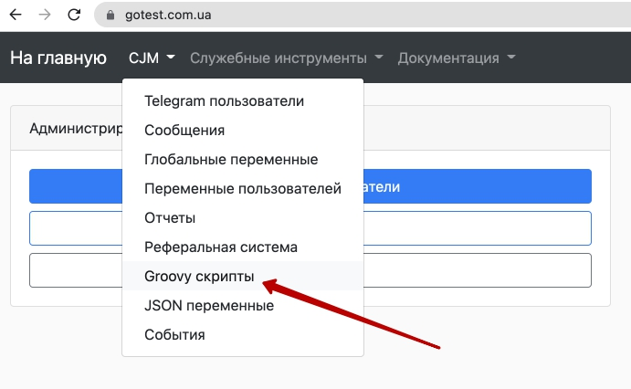
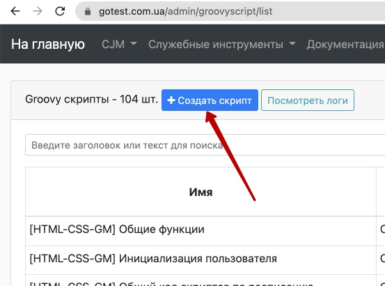
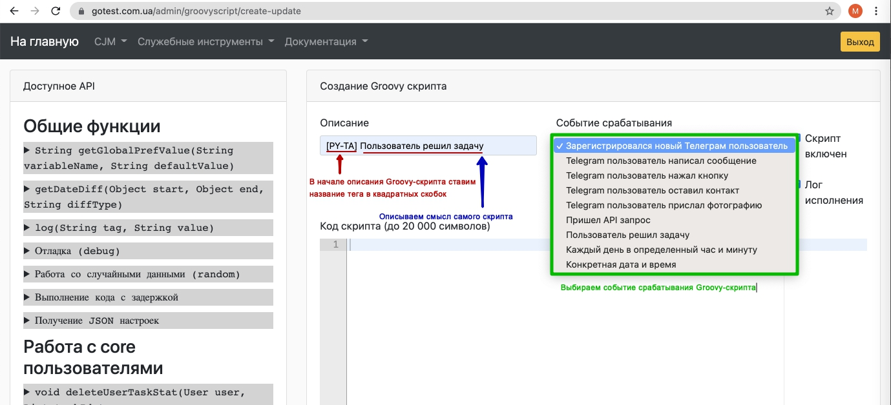

# Работа с Groovy-скриптами
**Groovy-скрипты** - это скрипты, написанные на языке Java, которые позволяют автоматизировать работу с пользователями ботом и системой автопроверки.


## Место Groovy-скрипта в административной панели бота
С основной страницы административной панели переходим в раздел с Groovy-скриптами


## Создание Groovy-скрипта  
Нажимаем кнопку "Создать скрипт"  


1. В начале описания скрипта ставим название тега в квадратных скобках.
2. В описании указываем смысл работы скрипта
3. Выбираем событие срабатывания 



## Копирование существующих Groovy-скриптов
В существующих Groovy-скриптах уже реализован широкий набор функциональных действий. Для того, чтобы скопировать и адаптировать функционал, разработанный под другой тег необходимо найти соответствующий скрипт,


## Скрипт при регистрации нового телеграм пользователя
В данном скрипте устанавливаются начальные значения переменных, обнуляются значение статистики, удаляются значения накопленных переменных.
```java
import java.time.*;

def registrationDate = {
    def today = LocalDateTime.now();
        
    return today;
};

//Переменные для жизней пользователя
commonActions.setUserVariable(user, 'pythonCurrentLiveCount', 3); //Сколько сейчас фактически жизней
commonActions.setUserVariable(user, 'pythonOldLiveCount', 3); //Сколько жизней было раньше

//Переменные для баллов пользователя
commonActions.setUserVariable(user, 'pythonCurrentScore', 30); //Сколько сейчас фактически баллов
commonActions.setUserVariable(user, 'pythonOldScore', 30); //Сколько баллов было раньше

//Переменная brandNewUser. Если true - значит пользователь новый
commonActions.setUserVariable(user, 'pythonBrandNewUser', true);

//Создаем переменную, которая определяет какой день пользователь уже прошел
commonActions.setUserVariable(user, 'dayNumberDone', 0);
commonActions.setUserVariable(user, 'dayNumberSend', 1);

commonActions.setUserVariable(user, 'regDay', registrationDate());

//Устанавливаем дефолтный язык русский
telegramUser.setLanguageCode('ru');
commonActions.saveTelegramUser(telegramUser);

//Отправляем стартовое сообщение
def message =
'''
А чтобы я мог сохранить ваш прогресс, нажми на кнопку *"Зарегистрироваться"*.
''';
commonActions.sendTelegramSimpleTextMessage(message, [telegramUser: telegramUser, sendOrdered: false, botName: 'goiteens_edu_bot'], 'bottomKeyboard\nЗарегистрироваться=>${requestContact}');

// СБРОС СТАТИСТИКИ
//Очищаем данные пользователя о решенных задачах по Python

def taskIds = [
   'python-ta-string-01',
    'python-ta-string-02',
    'python-ta-string-03',
    'python-ta-string-04',
    'python-ta-string-05',
    'python-ta-string-06',
    'python-ta-string-07'
];

//Сбрасываем статистику по решенным задачам
commonActions.deleteUserTaskStat(user, taskIds);

//Сбрасываем статистику по видеоподсказкам
commonActions.deleteUserVariables(user, taskIds);

//Сброс накопленных переменных
commonActions.deleteUserVariable(user, 'openedPythonMarathonSite');
commonActions.deleteUserVariable(user, 'finishedPythonMarathon');
commonActions.deleteUserVariable(user, 'finishPythonMarathonDate');
commonActions.deleteUserVariable(user, 'userRequestedPythonBonus');
```

## Скрипт, который запускается при решении каждой задачи
1. Проставление баллов за каждую задачу
2. Рассчет баллов (Add score) - добавление размера балла за задачу к значению соответствующе переменной (pythonCurrentScore)
3. Отправка сообщений пользователю, когда он решает последнюю задачу в блоке (механизм - отправляет сообщение при решении определенной задачи, какая именно задача является последней - проставляем вручную).
4. Для отправки сообщения используем следующий метод:
```java
    def keyboard =
'''inlineKeyboard
1=>pymarathon_day1_m1_1|2=>pymarathon_day1_m1_2|3=>pymarathon_day1_m1_3|4=>pymarathon_day1_m1_4|5=>pymarathon_day1_m1_5''';
    commonActions.sendTelegramSimpleTextMessage(message, [telegramUser: telegramUser, sendOrdered: false, botName: 'goiteens_python_bot'],keyboard);
```
**message** - текст сообщения  
**telegramUser** - объект, в котором хранится описание телеграм-пользователя (определяется вне скрипта)
**sendOrdered** - по названию: определение приоритета отправки (?)
**botName** - название бота, который отправляет сообщение.
**keyboard** - необязательный параметр с клавиатурой (набором кнопок)
5. keyboard

```java
def keyboard =
'''inlineKeyboard
1=>pymarathon_day1_m1_1|2=>pymarathon_day1_m1_2|3=>pymarathon_day1_m1_3|4=>pymarathon_day1_m1_4|5=>pymarathon_day1_m1_5''';
```
**1,2,3,4,5** - текст, который будет написан на кнопках, которые сможет нажать кнопки
**pymarathon_day1_m1_1,pymarathon_day1_m1_2,pymarathon_day1_m1_3,pymarathon_day1_m1_4,pymarathon_day1_m1_5** - значение переменных, которые получат значение true (?) при нажатии соответствующих кнопок.

1. 
```java
import java.time.*;

//Включаем режим отладки
debug.enable();

//Получаем информацию о пользователе
def tgUserInfo = telegramUser.userId + ' (' + telegramUser.getFullName() + ')';

def taskScore = [:];

//День 1
taskScore['python-ta-string-01'] = 2;
taskScore['python-ta-string-02'] = 2;
taskScore['python-ta-string-03'] = 2;
taskScore['python-ta-string-04'] = 2;
taskScore['python-ta-string-05'] = 2;
taskScore['python-ta-string-06'] = 2;
taskScore['python-ta-string-07'] = 2;
taskScore['python-ta-string-08'] = 2;

taskScore['python-ta-commands-if-01'] = 2;
taskScore['python-ta-commands-if-02'] = 2;
taskScore['python-ta-commands-if-03'] = 2;
taskScore['python-ta-commands-if-04'] = 2;
taskScore['python-ta-commands-if-05'] = 2;
taskScore['python-ta-commands-if-06'] = 2;
taskScore['python-ta-commands-if-07'] = 2;

taskScore['python-ta-types-01'] = 2;
taskScore['python-ta-types-02'] = 2;
taskScore['python-ta-types-03'] = 2;
taskScore['python-ta-types-04'] = 2;
taskScore['python-ta-types-05'] = 2;
taskScore['python-ta-types-06'] = 2;
taskScore['python-ta-types-07'] = 2;

taskScore['python-ta-string2list-01'] = 2;
taskScore['python-ta-string2list-02'] = 2;
taskScore['python-ta-string2list-03'] = 2;
taskScore['python-ta-string2list-04'] = 2;
taskScore['python-ta-string2list-05'] = 2;
taskScore['python-ta-string2list-06'] = 2;

def msg = taskId;

// commonActions.sendTelegramSimpleTextMessage(msg, [telegramUser: telegramUser, sendOrdered: false, botName: 'goiteens_python_bot']);

//User solved last task - set variable
// if (taskId.equals('python-ta-string-07')) {
//     commonActions.setUserVariable(user, 'finishedPythonMarathon', true);
//     commonActions.setUserVariable(user, 'finishPythonMarathonDate', LocalDateTime.now());
    
//     debug.log(tgUserInfo, '[USER FINISHED PYTHON GAME] Пользователь прошел игру');
// }

//Add score
if (taskScore.containsKey(taskId)) {
    def score = taskScore[taskId];
    
    //Set current score
    def currentScore = Integer.parseInt(commonActions.getUserVariable(user, 'pythonCurrentScore', 30));
    currentScore += score;
    
    commonActions.setUserVariable(user, 'pythonCurrentScore', currentScore);
    
    //update oldScore
    commonActions.setUserVariable(user, 'pythonOldScore', currentScore);
}

//Send message after day1
if (taskId.equals('python-ta-string-08')) {
   // commonActions.setUserVariable(user, 'pythonOldScore', currentScore);
    commonActions.setUserVariable(user, 'dayNumberDone', 1);
    def message =
'''
👏ЮХУ! Первая ступенька преодолена! Поздравляю!
Ты завершил все задачи первого дня.

Следующее задание придет завтра в 16:00.


${name}, как ощущения?

Оцени по шкале от 1 до 5, где:

1 - не понравилось, неинтересно🙁
5 - очень круто, чувствую себя супер-героем🔥
'''.replace('${name}', telegramUser.getFirstName());
    def keyboard =
'''inlineKeyboard
1=>pymarathon_day1_m1_1|2=>pymarathon_day1_m1_2|3=>pymarathon_day1_m1_3|4=>pymarathon_day1_m1_4|5=>pymarathon_day1_m1_5''';

    commonActions.sendTelegramSimpleTextMessage(message, [telegramUser: telegramUser, sendOrdered: false, botName: 'goiteens_python_bot'], keyboard);
}
//Send message after day2
if (taskId.equals('python-ta-commands-if-07')) {
    //commonActions.setUserVariable(user, 'pythonOldScore', currentScore);
    commonActions.setUserVariable(user, 'dayNumberDone', 2);
    //Добавляем в переменную сделанные дни +1
    //Чтобы в 16:00 отправляло новое сообщение или напоминало, что нужно доделать существующее
    def message = 
    '''
    Круто! Ты набираешь обороты, а твой бот уже научился реагировать на команды start и help, вот это да🔥
    
    Отдыхай и готовься, ведь завтра в 16:00 мы запрограммируем еще больше функционала. 
    
    На связи!
    ''';

    commonActions.sendTelegramSimpleTextMessage(message, [telegramUser: telegramUser, sendOrdered: false, botName: 'goiteens_python_bot']);

}

//Send message after day3
if (taskId.equals('python-ta-types-07')) {
    //commonActions.setUserVariable(user, 'pythonOldScore', currentScore);
    commonActions.setUserVariable(user, 'dayNumberDone', 3);
    def message = 
    '''
    ЕЕЕ! Отличный результат! Твой мозг поработал на славу😇
    
    Жди завтра в 16:00 новое задание.
    
    Дальше - больше😉

''';

    commonActions.sendTelegramSimpleTextMessage(message, [telegramUser: telegramUser, sendOrdered: false, botName: 'goiteens_python_bot']);
}


//Send message after day4
if (taskId.equals('python-ta-strings2list-07')) {
    //commonActions.setUserVariable(user, 'pythonOldScore', currentScore);
    commonActions.setUserVariable(user, 'dayNumberDone', 4);
    def message = 
    '''
    ЕЕЕ! Отличный результат! Твой мозг поработал на славу😇
    
    Жди завтра в 16:00 новое задание.
    
    Дальше - больше😉

''';

    commonActions.sendTelegramSimpleTextMessage(message, [telegramUser: telegramUser, sendOrdered: false, botName: 'goiteens_python_bot']);
}

//Send message after day5
if (taskId.equals('python-ta-files-05')) {
    //commonActions.setUserVariable(user, 'pythonOldScore', currentScore);
    commonActions.setUserVariable(user, 'dayNumberDone', 5);
    def message = 
    '''
    ЕЕЕ! Отличный результат! Твой мозг поработал на славу😇
    
    Жди завтра в 16:00 новое задание.
    
    Дальше - больше😉

''';

    commonActions.sendTelegramSimpleTextMessage(message, [telegramUser: telegramUser, sendOrdered: false, botName: 'goiteens_python_bot']);
}


//Send message after day6
if (taskId.equals('python-ta-for2list-01')) {
    //commonActions.setUserVariable(user, 'pythonOldScore', currentScore);
    commonActions.setUserVariable(user, 'dayNumberDone', 6);
    def message = 
    '''
    ЕЕЕ! Отличный результат! Твой мозг поработал на славу😇
    
    Жди завтра в 16:00 новое задание.
    
    Дальше - больше😉

''';

    commonActions.sendTelegramSimpleTextMessage(message, [telegramUser: telegramUser, sendOrdered: false, botName: 'goiteens_python_bot']);
}

//Send message after day7
if (taskId.equals('python-ta-functions-06')) {
    //commonActions.setUserVariable(user, 'pythonOldScore', currentScore);
    commonActions.setUserVariable(user, 'dayNumberDone', 7);
    def message = 
    '''
    ЕЕЕ! Отличный результат! Твой мозг поработал на славу😇
    
    Жди завтра в 16:00 новое задание.
    
    Дальше - больше😉

''';

    commonActions.sendTelegramSimpleTextMessage(message, [telegramUser: telegramUser, sendOrdered: false, botName: 'goiteens_python_bot']);
}


//Send message after day8
if (taskId.equals('python-ta-functions-check-01')) {
    //commonActions.setUserVariable(user, 'pythonOldScore', currentScore);
    commonActions.setUserVariable(user, 'dayNumberDone', 8);
    def message = 
    '''
    ЕЕЕ! Отличный результат! Твой мозг поработал на славу😇
    
    Жди завтра в 16:00 новое задание.
    
    Дальше - больше😉

''';

    commonActions.sendTelegramSimpleTextMessage(message, [telegramUser: telegramUser, sendOrdered: false, botName: 'goiteens_python_bot']);
}


//Send message after day9
if (taskId.equals('python-ta-lists-05')) {
    //commonActions.setUserVariable(user, 'pythonOldScore', currentScore);
    commonActions.setUserVariable(user, 'dayNumberDone', 9);
    def message = 
    '''
    ЕЕЕ! Отличный результат! Твой мозг поработал на славу😇
    
    Жди завтра в 16:00 новое задание.
    
    Дальше - больше😉

''';

    commonActions.sendTelegramSimpleTextMessage(message, [telegramUser: telegramUser, sendOrdered: false, botName: 'goiteens_python_bot']);
}

//Send message after day10
if (taskId.equals('python-ta-lists-count-01')) {
    //commonActions.setUserVariable(user, 'pythonOldScore', currentScore);
    commonActions.setUserVariable(user, 'dayNumberDone', 10);
    def message = 
    '''
    ЕЕЕ! Отличный результат! Твой мозг поработал на славу😇
    
    Жди завтра в 16:00 новое задание.
    
    Дальше - больше😉

''';

    commonActions.sendTelegramSimpleTextMessage(message, [telegramUser: telegramUser, sendOrdered: false, botName: 'goiteens_python_bot']);
}

//Send message after day11
if (taskId.equals('python-ta-dict-01')) {
    //commonActions.setUserVariable(user, 'pythonOldScore', currentScore);
    commonActions.setUserVariable(user, 'dayNumberDone', 11);
    def message = 
    '''
    ЕЕЕ! Отличный результат! Твой мозг поработал на славу😇
    
    Жди завтра в 16:00 новое задание.
    
    Дальше - больше😉

''';

    commonActions.sendTelegramSimpleTextMessage(message, [telegramUser: telegramUser, sendOrdered: false, botName: 'goiteens_python_bot']);
}


//Send message after day12
if (taskId.equals('python-ta-dict-count-01')) {
    //commonActions.setUserVariable(user, 'pythonOldScore', currentScore);
    commonActions.setUserVariable(user, 'dayNumberDone', 12);
    def message = 
    '''
    ЕЕЕ! Отличный результат! Твой мозг поработал на славу😇
    
    Жди завтра в 16:00 новое задание.
    
    Дальше - больше😉

''';

    commonActions.sendTelegramSimpleTextMessage(message, [telegramUser: telegramUser, sendOrdered: false, botName: 'goiteens_python_bot']);
}
```
## Ежедневная отправка (в 10:00 - напоминание)
Для отправки сообщений используется замыкание notifyUser, которое получает параметр **tgUser** (объект telegramUser, получаемый "из-за" скрипта) и **userData**, который получаем в списке 
```java
//Выбираем подходящих нам пользователей
def telegramUserQueryParams = [:];
telegramUserQueryParams['tag'] = 'PY_AUTO_COURSE'; // Тег Телеграм пользователей
// telegramUserQueryParams['maxRegisterDaysFromNow'] = '28'; //Пользователи, не старше 28 дней
telegramUserQueryParams['idIs'] = '394735340'; //ДЕБАГ - только мне слать
// telegramUserQueryParams['phoneIs'] = '380997852751'; //ДЕБАГ - только мне слать

def telegramUsers = commonActions.getTelegramUsersWithAllConditions(telegramUserQueryParams);

def telegramUsersData = commonActions.getAggregatedDataForTelegramUsers(telegramUsers);

for(telegramUser in telegramUsers) {
    def userData = telegramUsersData.getOrDefault(telegramUser.userId, null);
    try {
            notifyUser(telegramUser, userData); //Оповещаем пользователей
        
    } catch(ex) {
        debug.log(ex, telegramUser);
    }
}
```
Переменные - получаем используя метод get для объекта `telegramUsersData`, который, в свою очередь получаем как результат запроса с различными параметрами.
```java
def telegramUserQueryParams = [:];
telegramUserQueryParams['tag'] = 'PY_AUTO_COURSE'; // Тег Телеграм пользователей
// telegramUserQueryParams['maxRegisterDaysFromNow'] = '28'; //Пользователи, не старше 28 дней
telegramUserQueryParams['idIs'] = '394735340'; //ДЕБАГ - только мне слать
// telegramUserQueryParams['phoneIs'] = '380997852751'; //ДЕБАГ - только мне слать
def telegramUsers = commonActions.getTelegramUsersWithAllConditions(telegramUserQueryParams);

def telegramUsersData = commonActions.getAggregatedDataForTelegramUsers(telegramUsers);

...

 def userData1 = telegramUsersData.get(tgUser.userId);

    def dayNumberDone = Integer.parseInt(userData1.variables.getOrDefault('dayNumberDone', 0));
    def dayNumberSend = Integer.parseInt(userData1.variables.getOrDefault('dayNumberSend', 1));  

...
```

```java
import java.time.*;

//Включаем отладку
debug.enable();

commonActions.setUserVariable(user, 'dayNumberSend', 0);


//Выбираем подходящих нам пользователей
def telegramUserQueryParams = [:];
telegramUserQueryParams['tag'] = 'PY_AUTO_COURSE'; // Тег Телеграм пользователей
// telegramUserQueryParams['maxRegisterDaysFromNow'] = '28'; //Пользователи, не старше 28 дней
telegramUserQueryParams['idIs'] = '394735340'; //ДЕБАГ - только мне слать
// telegramUserQueryParams['phoneIs'] = '380997852751'; //ДЕБАГ - только мне слать

def telegramUsers = commonActions.getTelegramUsersWithAllConditions(telegramUserQueryParams);
debug.log('Количество оповещаемых пользователей: ' + telegramUsers.size());

//Если некого оповещать - не оповещаем
if (telegramUsers.size() <= 0) {
    return;
}

def telegramUsersData = commonActions.getAggregatedDataForTelegramUsers(telegramUsers);

def currentScore = Integer.parseInt(commonActions.getUserVariable(user, 'pythonCurrentScore', 20));

def daySend = 0;
//def marathonDay = commonActions.getUserVariable(user, 'dayNumberDone', 0)
// Замыкание - оповещаем пользователя что есть ссылка на задачи такого-то дня
def notifyUser = {tgUser, userData -> 
    def marathonDay = 0 //Читать день марафона из соответствующей переменной и/или из даты старта
    
    def userData1 = telegramUsersData.get(tgUser.userId);
    if (userData1 == null) {
        return -1;
    }
    
    def dayNumberDone = Integer.parseInt(userData1.variables.getOrDefault('dayNumberDone', 0));
    def dayNumberSend = Integer.parseInt(userData1.variables.getOrDefault('dayNumberSend', 1));    
    
    def blockHashes = ['0':'ijklmno156','1':'jklmnop157','2':'klmnop6158','3':'op67892162','4':'nop6789161','5':'p678923163','6':'mnop678160','7':'6789234164','8':'lmnop67159','9':'7892345165','10':'892345q166','11':'92345qr167'];

    def blockHash = blockHashes[dayNumberSend + ''];

    def token = userData.user.token;
    
    def taskNumber = dayNumberSend;
    
    def buttonName = "НАПОМНИМ ЗАДАНИЕ ${taskNumber}";

    def solveTasksLink = "https://goit.ua/python-marathon-autocheck/?token=${token}&block=${blockHash}";
    def keyboard = "inlineKeyboard\n${buttonName}=>${solveTasksLink}";
    

    def defaultMessage = ""

    def message = "";
    if (dayNumberDone < dayNumberSend){
        message = "Привет! Мы видим, что ты еще не успел сделать задание. Обрати внимание, что новое задание тебе прийдет сегодня в 16:00"
        commonActions.sendTelegramSimpleTextMessage(message, [telegramUser: tgUser, sendOrdered: false, botName: 'goiteens_python_bot'], keyboard);
    }
    else{
        message = "Привет! Круто, что ты сделал прошлое задание. Новое задание тебе прийдет сегодня в 16:00"
        commonActions.sendTelegramSimpleTextMessage(message, [telegramUser: tgUser, sendOrdered: false, botName: 'goiteens_python_bot']);
    }
}

//Пробегаемся по пользователям
for(telegramUser in telegramUsers) {
    def userData = telegramUsersData.getOrDefault(telegramUser.userId, null);
    def tgUserId = telegramUser.userId;
    def tgUserInfo = telegramUser.userId + ' (' + telegramUser.getFullName() + ')';
//    def marathonDay1 = Integer.parseInt(commonActions.getUserVariable(user, 'dayNumberDone', 3));


//    debug.log(tgUserInfo, marathonDay1);


    if (userData == null) {
        debug.log(tgUserInfo, '[WARNING] No user data');
        continue;
    }
    
    //Смотрим, нужно ли оповещать пользователя в этот день
    try {
            notifyUser(telegramUser, userData); //Оповещаем пользователей
        
    } catch(ex) {
        debug.log(ex, telegramUser);
    }
}
```

## Действия при отправке команды
Любые действия по запросу пользователя

```java

import java.time.*;

//Включаем отладку
debug.enable();

//Ссылки на чаты
def chatLinks = commonActions.getJsonPref('pythonGame').chatLinks;
// [
//     '2020-11-23': 'https://t.me/joinchat/NvnDERsVf-7-9GobIGqG6w',
//     '2020-12-07': 'https://t.me/joinchat/NvnDERwX5pCzuhYuaWh0Sw',
//     '2020-12-14': 'https://t.me/joinchat/NvnDERwTT4NXa5iHoEkeFw'
// ];


//Выбираем подходящих нам пользователей
def telegramUserQueryParams = [:];
telegramUserQueryParams['tag'] = 'PY-TA'; // Тег Телеграм пользователей
//telegramUserQueryParams['maxRegisterDaysFromNow'] = '28'; //Пользователи, не старше 28 дней
 telegramUserQueryParams['idIs'] = '394735340'; //ДЕБАГ - только мне слать
// telegramUserQueryParams['phoneIs'] = '380997852751'; //ДЕБАГ - только мне слать

def telegramUsers = commonActions.getTelegramUsersWithAllConditions(telegramUserQueryParams);
debug.log('Количество оповещаемых пользователей: ' + telegramUsers.size());

//Если некого оповещать - не оповещаем
if (telegramUsers.size() <= 0) {
    return;
}

def telegramUsersData = commonActions.getAggregatedDataForTelegramUsers(telegramUsers);

//Замыкание для определения текущего дня марафона
//def getMarathonDay = commonActions.getUserVariable(user, 'dayNumberDone', '0');
// Замыкание - оповещаем пользователя что есть ссылка на задачи такого-то дня
def notifyUser = {tgUser, userData -> 
    def chatLink = chatLinks[userData.variables.get('pyGameStartDate')];

    def marathonDay =  commonActions.getUserVariable(user, 'dayNumberDone', '0');

    def blockHashes = ['1': '892345q94', '2': 'mnop67852', '3': '345qrst97'];

    def blockHash = blockHashes[marathonDay + ''];
    def token = userData.user.token;
    
    def buttonName = "${marathonDay}-й день игры";

    def solveTasksLink = "https://goit.ua/python-marathon-autocheck/?token=${token}&block=${blockHash}";
    def keyboard = "inlineKeyboard\n${buttonName}=>${solveTasksLink}";
    
    def messages = [:];
    messages['1'] =
'''
Привет, ${name} 👋
Готовы сыграть?🚀 Начинаем прямо сейчас!

*Напомним: вы - будущий стартапер.*😎 Вы придумали крутую идею, способную изменить мир. Вы нашли инвестора и теперь *ваша цель - собрать команду мечты* из тысяч претендентов и показать ее инвестору, чтобы получить деньги. 💪

Чтобы справиться с задачей, вам предстоит создать *свою CRM-систему* - эдакую прокачанную записную книжку, которая посчитает все сама.🔥

Сегодня вас ждет увлекательная история: вы будете искать и найдете инвестора, уволите всю команду, но потом все же сделаете первую версию продукта... и это все в процессе изучения *синтаксиса языка Python*.😎 

*На реализацию у вас будет 3 дня = 3 жизни* 👌 
Каждый день будет приходить *ссылка на блок задач, которые нужно выполнить до 18:00* следующего дня. Не выполняете - жизни сгорают. 

*Если сгорят все - Game over*, игра окончена 🙌

Поэтому отнеситесь #повнимательнее к *дедлайну и решению задач*. А если возникнут вопросы - пишите их в чат 👉 [${chatLink}]  🔥

*Ссылка на первый день* уже ждет вас по кнопке ниже.👇 Успехов🙃
''';
    messages['2'] =
'''
Отправляем ссылку на *второй день задач* 😎 Сегодня познакомиться с с объектно-ориентированным программированием на Python💪: классами и объектами, полями и методами, наследованием; А также познакомитесь развития стартапа в формате Cust Dev.
Переходите по кнопке ниже и погнали. Напомню, что закончить задачи нужно *до завтра, 18:00*, иначе сгорит жизнь 🙌 

P.S. Закончите задачи прошлого дня, если вы не успели этого сделать, прежде, чем приступать к новым 👌
''';
    messages['3'] =
'''
*Вы почти у цели* 🤩

Сегодня третий день игры 🔥 Инвестор скоро будет в восторге - *проект мечты будет выведен на рынок!* Решайте задачи по кнопке ниже. Дедлайн - *до завтра, 18:00*. 

Завтра у нас завершающий день игры - *проведем занятие в формате вебинара в прямом эфире*, на котором будет *тестирование по материалам Python, которые вы успели выучить* 🚀

P.S. Напомним, что если у вас остались невыполненные задачи за прошлый день, закончите, прежде чем приступить к новым. Успехов 😎
''';
    
    def message = messages[marathonDay + ''].replace('${name}', tgUser.firstName).replace('${chatLink}', chatLink);
    commonActions.sendTelegramSimpleTextMessage(message, [telegramUser: tgUser, sendOrdered: false, botName: 'GoITeens_Python_autocourse_bot'], keyboard);
}

//Замыкание - должны ли мы списать пользователю жизнь в зависимости от дня марафона, и решенной им задачи
def shouldNotifyUser = {tgUser, userData ->
    def marathonDay = (int) commonActions.getUserVariable(user, 'dayNumberDone', '0');
    
    //Отправляем сообщения лишь в 1, 2, и 3-й дни
    return marathonDay == 1 || marathonDay == 2 || marathonDay == 3;
}

//Пробегаемся по пользователям
for(telegramUser in telegramUsers) {
    def userData = telegramUsersData.getOrDefault(telegramUser.userId, null);
    def tgUserId = telegramUser.userId;
    def tgUserInfo = telegramUser.userId + ' (' + telegramUser.getFullName() + ')';

    if (userData == null) {
        debug.log(tgUserInfo, '[WARNING] No user data');
        continue;
    }
    
    //Смотрим, нужно ли оповещать пользователя в этот день
    try {
        if (shouldNotifyUser(telegramUser, userData)) {
            notifyUser(telegramUser, userData); //Оповещаем пользователей
        }
    } catch(ex) {
        debug.log(ex, telegramUser);
    }
}


```

## Необходимо разобраться
1. Действия при отправке картинки
2. Какой параметр показывает то, что пользователь взял подсказку в задаче?
3. Разобраться со скриптами "Пользователь нажал на кнопку из стартовой цепочки", "Пользователь оставил контакт"
4. Разобраться с событием "Пришел API запрос" (откуда пришел, как отправлять)