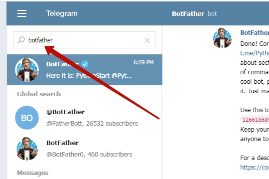

# Создание своего бота.
## Обращение к botfather
Новые боты создаются с помощью "Отца всех ботов": специального бота с именем `botfather`  
Для подключение к боту-создателю в поисковой строке в телеграмме наберите `botfather`  
  

## Команды к botfather
1. Выбираем меню команд.  
2. Выбираем команду `/newbot` (создать нового бота)  
  

## Создание имени нового бота
**1.** После команды `/newbot` `botfather` нас попросит ввести имя бота
**1.** После ввода имение `botfather` попросит ввести пользовательское имя бота (оно должно заканчиваться на `_bot`)
  

**!!! обязательно сохраните код доступа к боту - он нам понадобится!**
