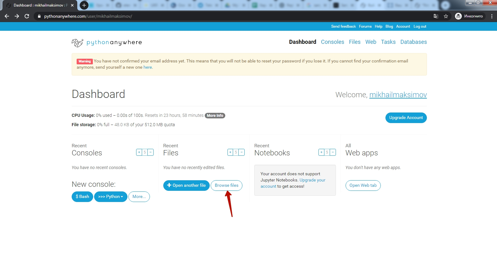

# Запуск программы эхо-бота
### На странице учетой записи pythonanywhere.com зайдите в раздел Files
  

### Создайте новый файл
**1** - введите имя создаваемого файла (в примере **botfile.py**)  
**2** - нажмите кнопку **"New file"**
  

### Запустите консоль
В открывшемся окне нажмите кнопку **"Bash console here"**
  

### Установите библиотеку для работы с Teleogram
В открывшееся окнок с черным фоном 