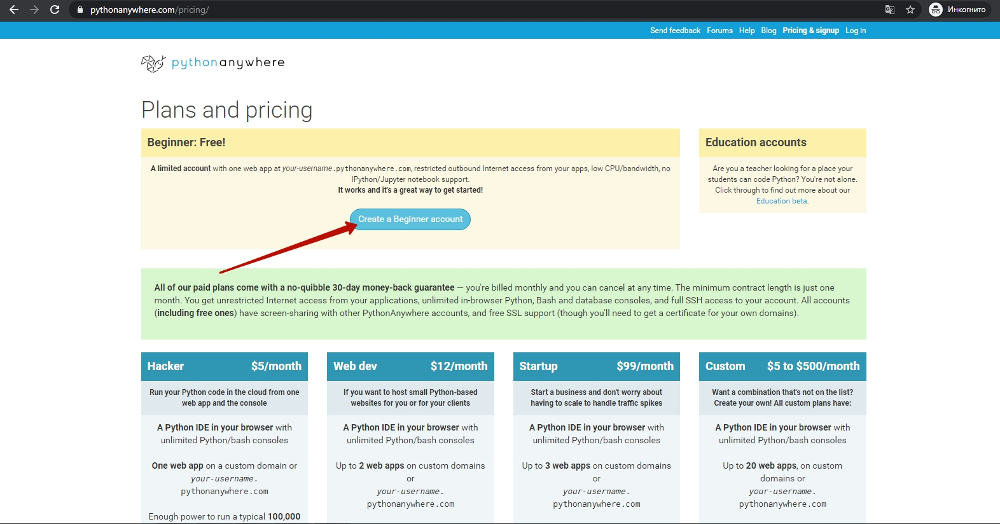

## Среда запуска Pythonanywhere
Создадим рабочее место на сервере [https://www.pythonanywhere.com/](https://www.pythonanywhere.com/).
  
Выбрать на главной странице создание кода  
  
Выбрать пакет "Начинающий"  
  
Зарегистрироваться  
  
Пропустить интерактивную инструкцию  
  
Перейти в раздел работы с файлами  
  
Создайте новый файл  

### Переменные в Python. Строки
"Hello, world" - это набор символов, т.е. строка. И мы можем эту строку сохранить в переменную. И выводить не сам набор символов, а уже значение переменной. Выглядит это как будто мы создали ящик с именем `s`, положили в этот ящик положили в определенной последовательности кубики Hello, world. А дальше - прочитали буквы на кубиках, которые лежали в ящике `s`  
```python
s = "Hello, world!"
print(s)
```
  

При этом для переменные со строками можно соединять:
```python
s1 = "Hello, "
s2 = "world!"
s = s1 + s2
print(s)
```
В дальнейшем - вы можете создавать файлы в разделе "Files" и запускать их.
### Закрытие запущенных консолей.
По условиям хостинга pythonanywhere может быть запущено одновременно не более чем 2 программы. В терминах данного хостинга - работать не более 2-х консолей одновременно.  
  
Поэтому необходимо останавливать запущенные консоли.  
  
  