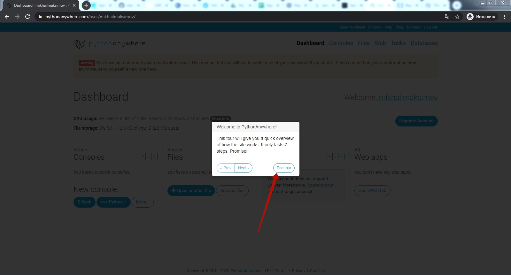

# Пробное занятие по Python
## Вступление
**Что такое Программирование?**  
Это сфера написания компьютерных программ.  
**Что такое компьютерные программы?**  
Это инструкции для компьютера, которые он умеет выполнять!
**Почему программирование хорошо оплачивается?**
Потому что одна программа заменяет большое количество людей длительное время. Первые программы писались для расчетов. В итоге 1 программа заменяла работу целого отдела математиков. В итоге - это позволяет хорошо оплачивать труд создателей программ.  
Принцип сохранился: программы заменяют людей, только расширились сферы применения:  
* Расчеты
* Учет
* Продажи
* Презентации
* Игры

А в последние несколько лет стало очень актуальным направления сбора и анализа данных и принятия, на основании этих данных решений. Т.е. компьютеры "научились" практически всему что умеют люди, программы искусственного интеллекта даже копируют структуру нашего мозга создавая искусственные нейронные сети, использующие тот же принцип работы, что и нейронные сети в мозгу человека.  
Чтобы понимать компьютеры очень помогают аналогии с людьми. Это хорошо работает, т.к. компьютеры созданы по примеру человека. У нас с ними похожая структура.  
А языки программирования и их использование похожи на использование человеческих языков. Английский - удобен для проведения переговоров по всему миру. Можно сказать, что это язык общего назначения. Но для того, чтобы жить и общаться, скажем - в Словакии. Лучше подойдет словацкий язык: коммуникация на нем с жителями Словакии будет происходить намного быстрее.  В то же время английский в Ирландии, Британии, США для повседневного общения подходит лучше других.
Так и языки программирования - каждый удобен для использования в определенной сфере. Python - это, как английский, может быть использован в большом количестве сфер, но есть те сферы, в которых он справляется лучше других: анализ данных, создание систем искусственного интеллекта и Web-программирование.  
### Как работают программы?
Программу можно представить в виде здания, которое выполняет определенную функцию: это может быть жилой дом, больница или офисный центр. Здания - состоят из кирпичиков, а программы состоят из команд (инструкций) для компьютера. А также из управляющих конструкций - которые говорят когда какие инструкции выполнять и переменных, которые хранят значения, которые программа обрабатывает. Т.е. инструкции - это как кирпичики, управляющие конструкции - это как указатели куда можно ходить (какие помещения из кирпичиков использовать), а переменные - это люди, которые ходят по помещению.
### Давайте попробуем?
У программистов есть традиция начинать изучение языка программирования с вывода строки `"Hello, world!"` - этой традиции уже 42 (!) года. Не будем изменять этой традиции.
Для того, чтобы вывести строку `"Hello, world!"` на языке программирования `Python` необходимо написать команду `print`:
```python
print("Hello, world!")
```
## Основы программирования
### Среда запуска.
Создадим рабочее место на сервере [https://www.pythonanywhere.com/](https://www.pythonanywhere.com/).
  
Выбрать на главной странице создание кода  
  
Выбрать пакет "Начинающий"  
  
Зарегистрироваться  
  
Пропустить интерактивную инструкцию  
  
Перейти в раздел работы с файлами  
  
Создайте новый файл  

### Переменные в Python. Строки
"Hello, world" - это набор символов, т.е. строка. И мы можем эту строку сохранить в переменную. И выводить не сам набор символов, а уже значение переменной. Выглядит это как будто мы создали ящик с именем `s`, положили в этот ящик положили в определенной последовательности кубики Hello, world. А дальше - прочитали буквы на кубиках, которые лежали в ящике `s`  
```python
s = "Hello, world!"
print(s)
```
  

При этом для переменные со строками можно соединять:
```python
s1 = "Hello, "
s2 = "world!"
s = s1 + s2
print(s)
```
